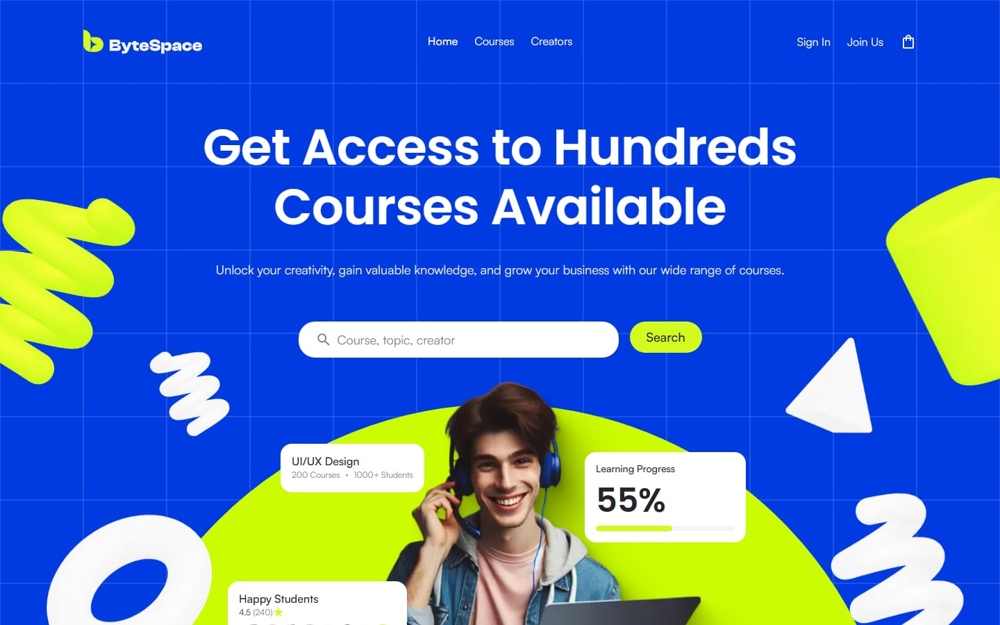
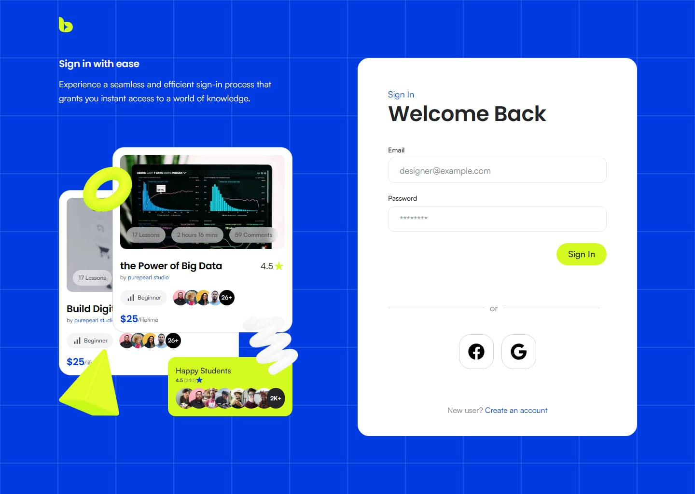
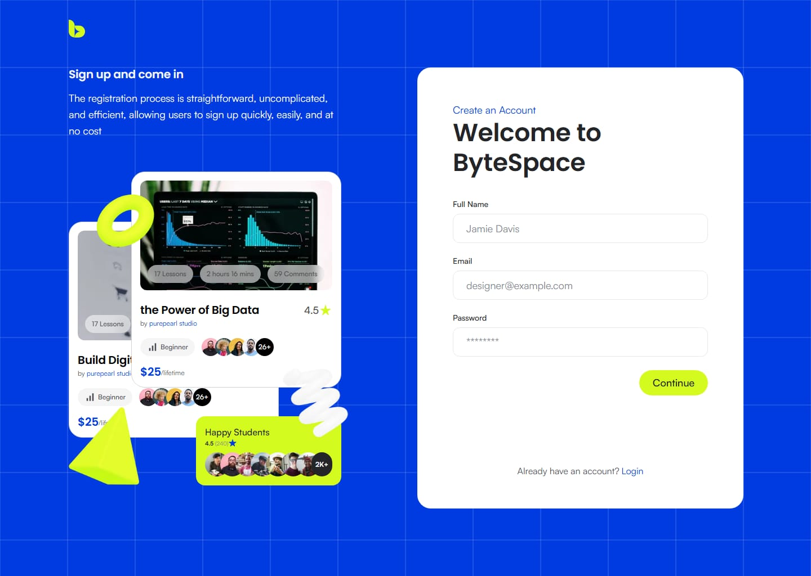
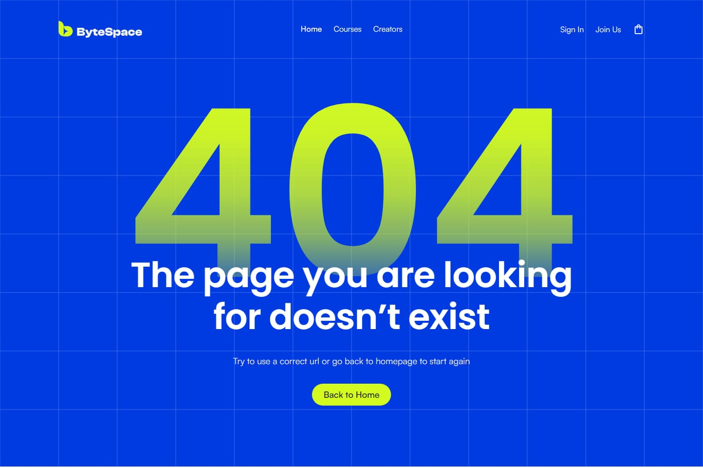
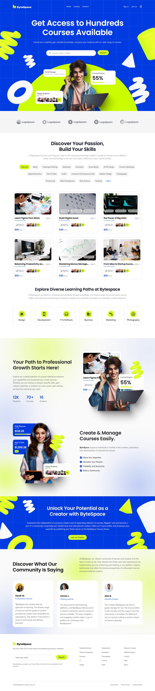
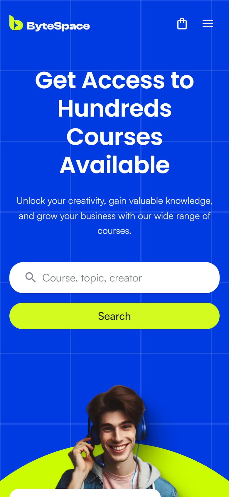
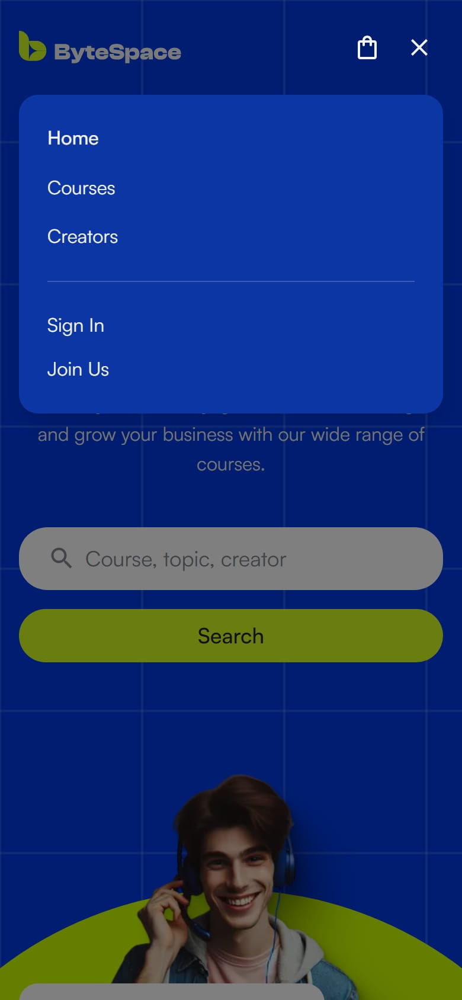
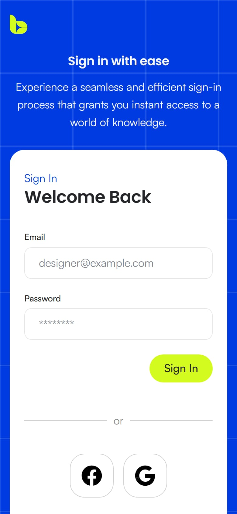
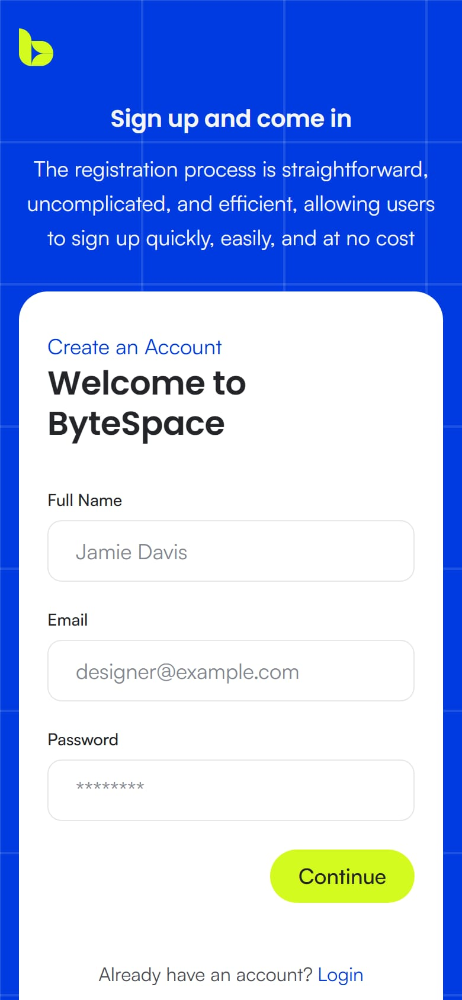
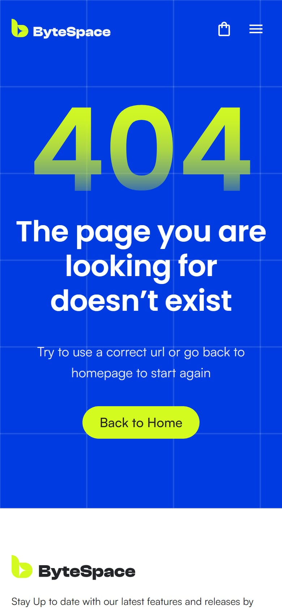

# ByteSpace New

An online learning platform built from the **"ByteSpace New" Figma design** — the landing page at
pixel level (1440px), our own responsive design for tablet and phone, and **working accounts**:
email/password sign-up and login and **Google sign-in**, backed by a real API and database.

**Live site:** https://bytespace-new-taupe.vercel.app
**API:** https://bytespace-backend.vercel.app/api/health

| | |
|---|---|
| Landing page (required) | ✅ Every section of the Figma "Home" frame, matched by measurement at 1440px |
| Login + Sign up (bonus) | ✅ The Figma frames, **fully working** — real accounts, sessions, Google sign-in |
| Responsive | ✅ Phone, tablet, laptop (Figma is desktop-only, so these layouts are ours) |
| Tests | ✅ Unit, component, API, end-to-end, accessibility — run in CI on every pull request |

---

## Screenshots

### Desktop (1440px)

| Landing page | Hero search → filtered courses |
|---|---|
|  |  |
| **Login** | **Sign up** |
|  |  |
| **404 page (Figma frame)** | **Signed in (real session)** |
|  |  |

<details>
<summary>Full landing page (one image)</summary>



</details>

### Phone (390px)

<table>
  <tr>
    <td align="center"><br>Landing page</td>
    <td align="center"><br>Menu</td>
    <td align="center"><br>Search results</td>
  </tr>
  <tr>
    <td align="center"><br>Login</td>
    <td align="center"><br>Sign up</td>
    <td align="center"><br>404</td>
  </tr>
</table>

---

## 1. Frontend

**Next.js 16 (App Router) · React 19 · TypeScript · Tailwind CSS 4 · TanStack Query · React Hook Form + Zod**

### Landing page — matched to Figma
- All sections of the Figma "Home" frame: header, hero (search, stat cards, 3D shapes), partner logos,
  "Discover Your Passion" (category chips + course cards), learning paths, growth stats,
  "Create & Manage Courses", the blue creator call-to-action, testimonials and the footer.
- **Exact values from the Figma file** (read through the Figma API, not eyeballed): every color, font size,
  line height and spacing is a design token in `frontend/src/app/globals.css`. After building each section,
  element positions were measured at 1440px with Playwright and compared with the Figma coordinates
  (0–1px apart). Even the design's small inconsistencies are kept (e.g. two different card line heights).
- Effects done the way Figma renders them: the 3D shapes are Figma renders (their tint uses a blend mode CSS
  can't reproduce), the photo shadows are pre-rendered images, the frosted badges use backdrop blur.
- **Hero search works:** it filters the course cards on the same page and scrolls to them
  ("2 courses for 'design'" + Clear search). The category chips filter the cards too.

### Responsive design (ours — Figma has desktop frames only)
- Phone: hamburger menu (dimmed page behind it, cart icon), swipeable category chips, 3 courses + "Show all",
  stacked sections. Tablet and small laptop: 2-column layouts until the full 1200px layout fits (1280px+).
- No horizontal scrolling at any width (checked by tests at phone and desktop sizes).

### Pages
| Route | |
|---|---|
| `/` | Landing page |
| `/login`, `/register` | Figma Login / Register frames, working forms (`/signup` redirects to `/register`) |
| `/privacy`, `/terms` | Privacy policy and terms (needed by Google sign-in; linked from the footer) |
| any other URL | The Figma "404 Not Found" frame |

### Accessibility
Semantic landmarks and headings, labelled inputs, visible focus styles, keyboard-usable menu, `aria-live`
announcements for filters and form errors, `prefers-reduced-motion` respected. Every page is scanned with
axe in the end-to-end tests.

### Frontend tests
| Kind | Tool | What |
|---|---|---|
| Unit / component (35 files) | Vitest + Testing Library | UI primitives, every section, forms (validation, server errors, slow server), session/navbar, search filtering, API client |
| End-to-end (10 spec files) | Playwright — desktop 1440 + phone | Navigation, hero search, chip filtering, login/register flows, layout vs. Figma coordinates, no overflow, 404 |
| Accessibility | axe-core in Playwright | Every page, WCAG A/AA rules |
| Smoke | Playwright `@smoke` | Runs against the live site (`BASE_URL=…`) |

The test cases were written with the help of agentic coding tools, then reviewed and run locally and in CI.

---

## 2. Authentication — it really works (not just the UI)

- **Sign up / log in** with email and password: the form validates in the browser (same rules as the API —
  both test suites run one shared list of cases), the API stores a **bcrypt** password hash, and the session is a
  signed **JWT in an HttpOnly cookie** (`Secure`, `SameSite=Lax`, 7 days). The navbar then shows "Hi, name" + Log out.
- **Email verification** (via **Brevo**): sign-up sends a "Verify your email" link (valid 24 hours, one use,
  only a hash stored). Password login works only after verifying; the link signs you in. "Resend" is on the
  sign-up confirmation and on the login page. Emails come from a Gmail sender (no own domain), so they may land
  in **spam**. Without an email service (local / Docker) the page shows the link itself.
- **Continue with Google** (Login page): real **OpenID Connect** sign-in with Google. The API checks the
  `state` (CSRF), then the ID token's signature, issuer, audience, expiry and nonce. A new Google user gets an
  account; an existing email/password account is linked only when Google says the email is verified.
- **Protection:** rate limits on login and sign-up (Redis), cross-site write protection (Origin check +
  JSON-only), generic "invalid email or password" (no account discovery), sessions can be revoked.
- Logging out updates the navbar instantly (the request finishes in the background).

---

## 3. Backend

**Express 5 · TypeScript · Prisma 7 · PostgreSQL · Redis · Zod · jose (JWT) · bcryptjs · pino logs**

| Method | Path | |
|---|---|---|
| GET | `/api/health`, `/api/health/ready` | Liveness / database readiness |
| POST | `/api/auth/register`, `/api/auth/login`, `/api/auth/logout` | Accounts and sessions |
| POST | `/api/auth/verify-email`, `/api/auth/resend-verification` | Email verification (Brevo) |
| GET | `/api/auth/me` | Current user (or `null`) |
| GET | `/api/auth/google`, `/api/auth/google/callback` | Google sign-in |

Layered structure (routes → controllers → services → Prisma), environment validated at startup, one error
format for every response. Details, security notes and configuration: [`backend/README.md`](backend/README.md).

**Backend tests (Vitest + Supertest, 9 files):** API tests against a real PostgreSQL test database and Redis —
sign-up, login, sessions, logout, validation, rate limits, cross-site blocking, Google sign-in (Google mocked:
new user, returning user, account linking, forged state, cancel), error handling.

---

## 4. Database and hosting

```
Browser ──> Vercel: website (Next.js) ──/api/* rewrite──> Vercel: API (Express) ──> Neon PostgreSQL (cloud)
                                                                                └─> Upstash Redis (cloud)
```

- **Production:** everything on free tiers — both apps on **Vercel**, the database on **Neon** (serverless
  PostgreSQL), rate limits in **Upstash Redis**, all in Singapore. The browser only talks to the website, which
  forwards `/api/*` to the API, so cookies are first-party and no CORS is needed. Database migrations run
  automatically on each production deploy.
- **Local:** the same stack in **Docker** — PostgreSQL, Redis, the API and the website (next section).

---

## 5. Run it locally

You need **Node.js 22.12+** and, for option A, **Docker Desktop**.

```bash
git clone https://github.com/SiamFS/bytespace-new.git
cd bytespace-new
```

### A. Docker — one command (recommended)

```bash
node scripts/docker-up.mjs
```

It starts Docker Desktop if it isn't running, builds and starts **PostgreSQL, Redis, the API and the website**,
waits until all four are healthy, and opens http://localhost:3000. First run takes a few minutes.

```bash
node scripts/docker-up.mjs --down     # stop everything (or: docker compose down)
docker compose logs -f backend        # API logs
```

### B. Without Docker — one command

```bash
node scripts/dev-local.mjs
```

Installs the packages, creates `backend/.env` (with a new random secret), applies the database migrations, then
starts the API (:4000) and the website (:3000) with hot reload. Ctrl+C stops both.
It needs a **PostgreSQL** database: set `DATABASE_URL` in `backend/.env` to a local PostgreSQL install or a free
[Neon](https://neon.tech) database. Redis is optional (without it, rate limits are kept in memory).

### C. Manually

```bash
docker compose up -d postgres redis          # or your own PostgreSQL / Redis
cd backend  && cp .env.example .env && npm ci && npx prisma migrate deploy && npm run dev
cd frontend && npm ci && npm run dev         # second terminal
```

### Google sign-in locally (optional)
Add `GOOGLE_CLIENT_ID` and `GOOGLE_CLIENT_SECRET` to `backend/.env` (Google Cloud Console → Web application client,
redirect URI `http://localhost:3000/api/auth/google/callback`). Works with A, B and C. Without them the Google
button explains that Google sign-in isn't available.

> The Satoshi font is downloaded during `npm run dev` / `npm run build` — its licence doesn't allow committing it.

---

## 6. Tests and CI

```bash
# frontend/
npm run lint && npm run typecheck
npm test                 # unit + component (Vitest)
npm run test:e2e         # builds, then Playwright E2E + axe (desktop + phone)
BASE_URL=https://bytespace-new-taupe.vercel.app npm run test:smoke

# backend/  (needs: docker compose up -d postgres redis)
npm run lint && npm run typecheck
npm test                 # unit + API tests (real PostgreSQL + Redis)
```

**GitHub Actions** runs three jobs on every pull request: **frontend** (lint, types, unit, build, E2E + axe),
**backend** (lint, types, tests with PostgreSQL + Redis services, build, Docker image) and **full stack**
(real API + website in a browser: sign up → session → logout → login).

---

## 7. Project structure

```
frontend/   Next.js app
  src/app/          routes only (pages, layouts, globals.css with the design tokens)
  src/components/   ui/ (primitives) · layout/ (navbar, footer) · sections/ (landing sections)
                    features/ (cards) · auth/ (forms)
  src/data/         content copied from Figma        src/lib/  API client, auth helpers
  e2e/              Playwright tests
backend/    Express API — src/{routes,controllers,services,middleware,schemas,lib,config}, prisma/, test/
scripts/    docker-up.mjs (one-command Docker) · dev-local.mjs (no Docker)
docker-compose.yml  PostgreSQL + Redis + API + website
```

---

## 8. Notes for reviewers

- **Figma is desktop-only (1440px)** — phone/tablet layouts, the mobile menu, hover/focus states, form error
  states and the signed-in navbar are our design.
- **Followed the design even where it's unusual:** the footer newsletter button says "Search" (as in Figma),
  the grey `#82868e` text is below WCAG AA contrast (so only axe's color-contrast rule is turned off), and the
  404 page shows "Home" as active.
- **Outside the required scope:** course detail pages, creator pages, cart, the Facebook button and footer
  pages other than Privacy/Terms are placeholders (they show the 404 page). Password reset and email
  verification are not built.
- The live API runs as a serverless function: the very first request after a quiet period can take a few
  seconds; the site shows a "waking up the server" message if a form waits that long.
